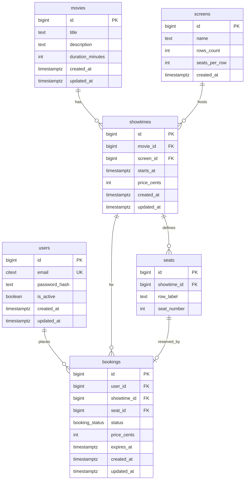

# CineBook — Phase 2 database schema

This document is the **contract** for Phase 3 (SQLAlchemy models) and Alembic migrations. It captures entities, relationships, constraints, and enums so later phases (locking, cache keys, Celery expiry) stay consistent.

## What Phase 2 is (and is not)

| In scope | Out of scope (later phases) |
|----------|-----------------------------|
| Tables, columns, PK/FK, uniqueness | SQLAlchemy `Mapped`, Alembic revision files |
| PostgreSQL enums / check constraints | API routes and Pydantic schemas |
| Indexes for expected queries | `SELECT FOR UPDATE`, Redis locks (Phase 6) |
| Notes for cache invalidation keys (Phase 7) | Celery task code (Phase 8) |

## Domain overview

- A **movie** is catalog metadata.
- A **showtime** is one screening of a movie at a specific start time in a **screen** (auditorium).
- **Seats** are defined **per showtime** (a fixed grid for that screening). Same physical “A1” can exist across showtimes as separate rows.
- A **booking** reserves **one seat** for **one showtime** for **one user**. Payment flows can be modeled with `pending` → `confirmed` or `expired`.

## Enums

### `booking_status` (PostgreSQL enum)

| Value | Meaning |
|-------|---------|
| `pending` | Hold created; payment or confirmation not finished. Subject to `expires_at` (Phase 8). |
| `confirmed` | Successfully reserved / paid. |
| `cancelled` | Explicitly cancelled; seat becomes available again. |
| `expired` | Hold timed out; seat becomes available again. |

Application code should treat only `pending` and `confirmed` as blocking the seat (see partial unique index below).

## Tables

### `users`

| Column | Type | Notes |
|--------|------|--------|
| `id` | `BIGSERIAL` | Primary key. |
| `email` | `CITEXT` | **Unique**. Case-insensitive emails. |
| `password_hash` | `TEXT` | Passlib/bcrypt output (Phase 5). |
| `is_active` | `BOOLEAN` | Default `TRUE`; disable login without deleting rows. |
| `created_at` | `TIMESTAMPTZ` | Default `now()`. |
| `updated_at` | `TIMESTAMPTZ` | Maintained by app or trigger. |

**Indexes:** unique on `email`.

### `movies`

| Column | Type | Notes |
|--------|------|--------|
| `id` | `BIGSERIAL` | Primary key. |
| `title` | `TEXT` | Required. |
| `description` | `TEXT` | Optional. |
| `duration_minutes` | `INT` | > 0. |
| `created_at` | `TIMESTAMPTZ` | Default `now()`. |
| `updated_at` | `TIMESTAMPTZ` | |

**Indexes:** optional `title` for admin search (Phase 4+).

### `screens`

Represents a physical auditorium. **Seat grids are defined per showtime** (see `seats`), but `rows_count` / `seats_per_row` document capacity for generating seats when a showtime is created.

| Column | Type | Notes |
|--------|------|--------|
| `id` | `BIGSERIAL` | Primary key. |
| `name` | `TEXT` | e.g. `"Screen 1"`. |
| `rows_count` | `INT` | > 0. |
| `seats_per_row` | `INT` | > 0. |
| `created_at` | `TIMESTAMPTZ` | Default `now()`. |

### `showtimes`

| Column | Type | Notes |
|--------|------|--------|
| `id` | `BIGSERIAL` | Primary key. |
| `movie_id` | `BIGINT` | FK → `movies(id)` **ON DELETE RESTRICT**. |
| `screen_id` | `BIGINT` | FK → `screens(id)` **ON DELETE RESTRICT**. |
| `starts_at` | `TIMESTAMPTZ` | Screening start. |
| `price_cents` | `INT` | ≥ 0; single price tier per showtime for simplicity. |
| `created_at` | `TIMESTAMPTZ` | Default `now()`. |
| `updated_at` | `TIMESTAMPTZ` | |

**Indexes:**

- `(movie_id, starts_at)` — list showtimes for a movie.
- `(starts_at)` — upcoming screenings / cron scans.

**Constraint (recommended):** `UNIQUE (screen_id, starts_at)` so the same screen cannot host two overlapping listings if your app only stores start times (optional; if you allow overlapping for data entry errors, skip—here we assume one row per screen per start).

### `seats`

One row per seat **for a given showtime**.

| Column | Type | Notes |
|--------|------|--------|
| `id` | `BIGSERIAL` | Primary key. |
| `showtime_id` | `BIGINT` | FK → `showtimes(id)` **ON DELETE CASCADE** (if showtime removed, seats go). |
| `row_label` | `TEXT` | e.g. `"A"`, `"B"`. |
| `seat_number` | `INT` | ≥ 1 within row. |

**Constraints:**

- `UNIQUE (showtime_id, row_label, seat_number)` — no duplicate seat labels per showtime.

**Indexes:**

- `(showtime_id)` — availability queries and `SELECT FOR UPDATE` by showtime (Phase 6).

### `bookings`

| Column | Type | Notes |
|--------|------|--------|
| `id` | `BIGSERIAL` | Primary key. |
| `user_id` | `BIGINT` | FK → `users(id)` **ON DELETE RESTRICT**. |
| `showtime_id` | `BIGINT` | FK → `showtimes(id)` **ON DELETE RESTRICT**. |
| `seat_id` | `BIGINT` | FK → `seats(id)` **ON DELETE RESTRICT**. |
| `status` | `booking_status` | Enum. |
| `price_cents` | `INT` | Snapshot from showtime at booking time. |
| `expires_at` | `TIMESTAMPTZ` | Nullable; set for `pending` (TTL for holds). |
| `created_at` | `TIMESTAMPTZ` | Default `now()`. |
| `updated_at` | `TIMESTAMPTZ` | |

**Constraints:**

- **Partial unique index** on `seat_id` where `status` in (`pending`, `confirmed`): at most **one active** booking per seat. Cancelled/expired rows do not block new bookings.

**Indexes:**

- `(user_id, created_at)` — user history.
- `(showtime_id)` — list bookings for a screening.
- `(expires_at)` where `status = 'pending'` — expiry sweeps (Phase 8).

## Design decisions (short)

1. **Seats per showtime** — Avoids a separate “instance” table for each screening while keeping a stable `seat_id` to lock and cache (`showtime_id` + `seat_id` keys for Redis in Phase 7).
2. **`price_cents` on booking** — Preserves price at reservation if showtime price changes later.
3. **Partial unique index** — Stronger than “only one row per seat” globally: allows history of `cancelled`/`expired` rows if you choose to keep them; for a minimal schema you could instead delete those rows and use a simple `UNIQUE(seat_id)` for active bookings only—this doc keeps history-friendly rows.
4. **`CITEXT` for email** — Requires `CREATE EXTENSION IF NOT EXISTS citext` in migration (PostgreSQL).

## Phase handoff

| Phase | Uses this schema for |
|-------|----------------------|
| 3 | SQLAlchemy models + Alembic |
| 5 | `users.password_hash`, JWT subject = `users.id` |
| 6 | Lock `seats` / `bookings` rows for a `showtime_id` + `seat_id` |
| 7 | Cache key e.g. `seatmap:{showtime_id}` or `available:{showtime_id}` |
| 8 | Celery: expire `pending` where `expires_at < now()` |
